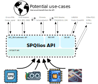

# SPQlios library


The SPQlios library provides fast arithmetic for Fully Homomorphic Encryption, and other lattice constructions that arise in post quantum cryptography.



Namely, it is divided into 4 sections:

* The low-level DFT section support FFT over 64-bit floats, as well as NTT modulo one fixed 120-bit modulus. It is an upgrade of the original spqlios-fft module embedded in the TFHE library since 2016. The DFT section exposes the traditional DFT, inverse-DFT, and coefficient-wise multiplications in DFT space.
* The VEC_ZNX section exposes fast algebra over vectors of small integer polynomial modulo $X^N+1$. It proposed in particular efficient (prepared) vector-matrix products, scalar-vector products, convolution products, and element-wise products, operations that naturally occurs on gadget-decomposed Ring-LWE coordinates.
* The RNX section is a simpler variant of VEC_ZNX, to represent single polynomials modulo $X^N+1$  (over the reals or over the torus) when the coefficient precision fits on 64-bit doubles. The small vector-matrix API of the RNX section is particularly adapted to reproducing the fastest CGGI-based bootstrappings.
* The ZN section focuses over vector and matrix algebra over scalars (used by scalar LWE, or scalar key-switches, but also on non-ring schemes like Frodo, FrodoPIR, and SimplePIR).

### A high value target for hardware accelerations

SPQlios is more than a library, it is also a good target for hardware developers. 
On one hand, the arithmetic operations that are defined in the library have a clear standalone mathematical definition. And at the same time, the amount of work in each operations is sufficiently large so that meaningful functions only require a few of these.

This makes the SPQlios API a high value target for hardware acceleration, that targets FHE.

### SPQLios is not an FHE library, but a huge enabler

SPQlios itself is not an FHE library: there is no ciphertext, plaintext or key. It is a mathematical library that exposes efficient algebra over polynomials. Using the functions exposed, it is possible to quickly build efficient FHE libraries, with support for the main schemes based on Ring-LWE: BFV, BGV, CGGI, DM, CKKS.


## Dependencies 

The SPQLIOS-FFT library is a C library that can be compiled with a standard C compiler, and depends only on libc and libm. The API 
interface can be used in a regular C code, and any other language via classical foreign APIs. 

The unittests and integration tests are in an optional part of the code, and are written in C++.  These tests rely on 
[```benchmark```](https://github.com/google/benchmark), and [```gtest```](https://github.com/google/googletest) libraries, and therefore require a C++17 compiler.

Currently, the project has been tested with the gcc,g++ >= 11.3.0 compiler under Linux (x86_64). In the future, we plan to
extend the compatibility to other compilers, platforms and operating systems. 


## Installation

The library uses a classical ```cmake``` build mechanism: use ```cmake``` to create a ```build``` folder in the top level directory and run ```make``` from inside it. This assumes that the standard tool ```cmake``` is already installed on the system, and an up-to-date c++ compiler (i.e. g++ >=11.3.0) as well.

It will compile the shared library in optimized mode, and ```make install``` install it to the desired prefix folder (by default ```/usr/local/lib```).

If you want to choose additional compile options (i.e. other installation folder, debug mode, tests), you need to run cmake manually and pass the desired options:
```
mkdir build
cd build
cmake ../src -CMAKE_INSTALL_PREFIX=/usr/
make
```
The available options are the following:

| Variable Name        | values                                                       |
| -------------------- | ------------------------------------------------------------ |
| CMAKE_INSTALL_PREFIX | */usr/local* installation folder (libs go in lib/ and headers in include/) |
| WARNING_PARANOID     | All warnings are shown and treated as errors. Off by default |
| ENABLE_TESTING       | Compiles unit tests and integration tests                    |

------


